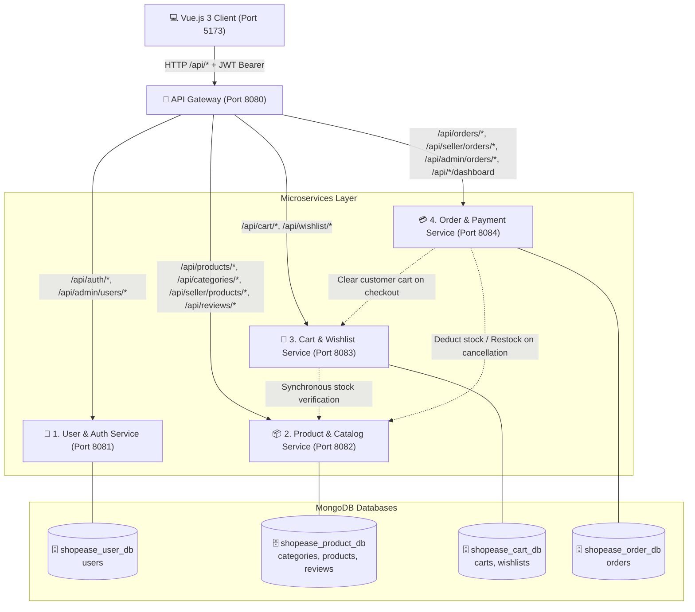
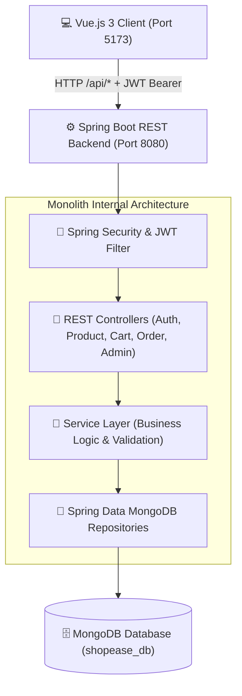

# 🛒 ShopEase: Enterprise Full-Stack E-Commerce Platform

[](#-2-technology-stack)
[](#-2-technology-stack)
[](#-2-technology-stack)
[](#-3-system-architecture)
[](#-4-functional-features)

---

## 📖 Abstract

**ShopEase** is a modern, enterprise-grade e-commerce and shopping cart platform engineered to deliver seamless online shopping experiences. The platform combines a responsive, component-driven **Vue.js 3** frontend with robust **Spring Boot 3** services backed by **MongoDB** document storage. 

Designed with architectural flexibility in mind, ShopEase demonstrates two interchangeable enterprise paradigms:
1. **Layered Monolithic Architecture**: An integrated, single-deployable REST API ideal for rapid prototyping and streamlined deployments.
2. **Distributed 4-Microservices Architecture**: A scalable, event-ready microservices ecosystem with isolated persistence and an intelligent API Gateway.

Both architectures maintain **100% functional parity** and work out of the box with the same client interface.

---

## 🌟 1. Project Overview & Highlights

ShopEase bridges the gap between clean theoretical design and real-world commercial software engineering:

- 🛍️ **Multi-Role Workflows**: Tailored, isolated experiences for **Customers**, **Sellers**, and **Platform Administrators**.
- 🔄 **Architectural Dual-Mode**: Seamlessly switch between a unified monolithic backend and a 4-service microservices network.
- ⚡ **Reactive Client**: Powered by Vue 3, Vite, and Pinia for instantaneous state updates (cart counters, instant wishlisting, dynamic search).
- 🔐 **Stateless Security**: End-to-end JWT authentication with role-based route protection and BCrypt password encryption.
- 📊 **Real-Time Analytics**: Tailored dashboards displaying gross sales revenue, order fulfillment rates, and low-inventory warnings.

---

## 🛠️ 2. Technology Stack

| Layer | Technologies & Frameworks | Role in System |
|---|---|---|
| **Frontend** | Vue.js 3, Vite, Vue Router, Pinia, Axios, Bootstrap 5, Sass | Interactive SPA, state management, and modern UI |
| **Backend Framework** | Java 17/21/24, Spring Boot 3.2.5, Spring Web, Spring Security | RESTful web services, dependency injection, and core logic |
| **Microservices Layer** | Multi-Module Maven, Spring RestClient, Spring Boot API Gateway | Distributed service communication and reverse proxy routing |
| **Persistence** | MongoDB 6.0+, Spring Data MongoDB | High-throughput document storage with isolated namespaces |
| **Security** | JJWT 0.12.5 (HMAC-SHA256), BCrypt, RBAC | Stateless authentication and granular permission authorization |
| **API Documentation** | Springdoc OpenAPI 3.0 / Swagger UI | Interactive endpoint discovery and live request testing |
| **Development IDEs** | IntelliJ IDEA (Services & Monolith), Visual Studio Code (Vue) | Professional development environments |

---

## 🏛️ 3. System Architecture

ShopEase allows developers to explore both monolithic and distributed paradigms without altering a single line of frontend code.

---

### 🚀 3.1 Distributed 4-Microservices Architecture (Recommended)

In microservices mode, domain responsibilities are decoupled into four standalone services coordinated by an API Gateway:



#### 📋 Microservices Specifications

| Microservice | Port | Database Namespace | Primary Scope |
|---|---|---|---|
| **👤 User Service** | `8081` | `shopease_user_db` | User registration, login, JWT token generation, profile, and administrative user controls. |
| **📦 Product Service** | `8082` | `shopease_product_db` | Product catalog, categories, search/filters, seller inventory, reviews, and stock operations. |
| **🛒 Cart Service** | `8083` | `shopease_cart_db` | Customer shopping cart, wishlist, live product stock validation, and move-to-cart operations. |
| **💳 Order Service** | `8084` | `shopease_order_db` | Distributed checkout, payments, seller order fulfillment, cancellation inventory restoration, analytics. |
| **🚪 API Gateway** | `8080` | *Stateless* | Reverse proxy routing, CORS filtering, and JWT authorization header propagation. |

---

### 🏢 3.2 Monolithic Layered Architecture

In monolith mode, all business modules reside inside a unified Spring Boot application:



---

## 🎯 4. Functional Features

### 🔐 4.1 Authentication & Security
- **Role-Based Access Control**: Separate privilege sets for `CUSTOMER`, `SELLER`, and `ADMIN`.
- **JWT Authentication**: Secure stateless tokens containing claims and verified on every request.
- **BCrypt Encryption**: One-way salted hashing for stored credentials.
- **Route Guards**: Frontend navigation guards paired with backend filter-level permission checks.

### 🛍️ 4.2 Customer Portal
- **Catalog Discovery**: Search by keywords, filter by category and price range, and sort by rating or newest arrivals.
- **Interactive Shopping Cart**: Live quantity increments, real-time subtotal calculations, and item removals.
- **Wishlist Integration**: Save favorite items and transfer wishlist products to the shopping cart in a single click.
- **Checkout & Payments**: Mock credit/debit card processing and Cash on Delivery (COD) options.
- **Order Tracking & Cancellation**: View historical orders, monitor delivery status, and cancel eligible orders with automated restocking.
- **Customer Reviews**: Submit star ratings (1–5) and written feedback with dynamic average rating recalculation.

### 💼 4.3 Seller Portal
- **Seller Analytics**: Monitor gross product sales, pending order fulfillment, and low-inventory items.
- **Inventory Management**: Create, update, and remove products with pricing, descriptions, and imagery.
- **Order Management**: Track customer orders containing seller-specific merchandise and update delivery status (`PENDING` → `SHIPPED` → `DELIVERED`).

### 👑 4.4 Administrator Portal
- **Executive Metrics**: Platform-wide visibility across total users, revenue, active orders, and product counts.
- **User Oversight**: Search user directory, filter by role, activate or deactivate accounts, and delete records.
- **Category Management**: Create, edit, and organize product categories.
- **Order Inspection**: Complete access to all platform transactions.

---

## 📂 5. Project Structure

```text
full_stack_shopping_cart/
├── 🌐 frontend/                  # Vue.js 3 Client Application (Vite + Pinia)
│   ├── package.json
│   ├── vite.config.js
│   ├── index.html
│   └── src/
│       ├── components/          # Reusable components (Navbar, Modals, Cards)
│       ├── router/              # Navigation routes & authentication guards
│       ├── services/            # Axios API client (targets http://localhost:8080/api)
│       ├── stores/              # Pinia global state stores (auth.js, cart.js)
│       └── views/               # Customer, Seller, Admin, and Authentication screens
│
├── ⚙️ microservices/             # Distributed 4-Microservices Architecture (Spring Boot 3)
│   ├── pom.xml                  # Multi-module Maven descriptor
│   ├── README.md                # Comprehensive microservices architectural guide
│   ├── .run/                    # Pre-configured IntelliJ IDEA Run Configurations
│   │   ├── ApiGatewayApplication.run.xml
│   │   ├── CartServiceApplication.run.xml
│   │   ├── OrderServiceApplication.run.xml
│   │   ├── ProductServiceApplication.run.xml
│   │   └── UserServiceApplication.run.xml
│   ├── 🚪 api-gateway/          # Port 8080 - Unified reverse proxy router
│   ├── 👤 user-service/         # Port 8081 - Auth & Account management (shopease_user_db)
│   ├── 📦 product-service/      # Port 8082 - Catalog, Categories, Reviews (shopease_product_db)
│   ├── 🛒 cart-service/         # Port 8083 - Cart & Wishlist (shopease_cart_db)
│   └── 💳 order-service/        # Port 8084 - Checkout, Orders, Analytics (shopease_order_db)
│
├── 📦 backend/                   # Original Monolithic Spring Boot Backend (Port 8080)
│   ├── pom.xml
│   └── src/
│
├── 📄 .env.example              # Safe environment variable template
├── 🔒 .gitignore                # Security-hardened gitignore
├── 📖 explain.md                # Beginner architecture and dataflow guide
└── 📘 README.md                 # Primary system documentation
```

---

## 💻 6. Prerequisites

Ensure the following tools are installed:
- **Java Development Kit (JDK)**: Version 17 or higher (JDK 21 & 24 fully supported).
- **Maven**: Version 3.8 or higher.
- **Node.js & npm**: Node.js 18+ and npm 9+.
- **MongoDB**: Version 6.0+, running locally on `localhost:27017` or accessible via MongoDB Atlas.
- **IDE**: IntelliJ IDEA (recommended for Spring Boot) and Visual Studio Code (for Vue).

---

## 🗄️ 7. Database Configuration

Start your MongoDB instance on the default local port (`27017`):
```bash
brew services start mongodb-community
# or
mongod --dbpath /path/to/data
```

- **Monolith Mode**: Data is stored in database `shopease_db`.
- **Microservices Mode**: Data is segregated into:
  - `shopease_user_db` (users)
  - `shopease_product_db` (categories, products, reviews)
  - `shopease_cart_db` (carts, wishlists)
  - `shopease_order_db` (orders)

Collections and databases are created automatically upon initial write.

---

## 🚀 8. Running the Backend

You can launch either the **Microservices Architecture** (Option A) or the **Monolith** (Option B):

### 🌟 Option A: Running the Microservices in IntelliJ IDEA (Recommended)

1. **Open the Project**:
   - In IntelliJ IDEA, select **File -> Open...**
   - Select the [microservices](file:///Users/jhansisiva/Documents/Win%20college%20/sem5/web%20devolopment/full_stack_shopping_cart/microservices) directory.
   - IntelliJ IDEA automatically recognizes `pom.xml` as a Maven Multi-Module project and loads all 5 submodules.
2. **Start the Services**:
   - Open the **Services** tool window (**View -> Tool Windows -> Services** or `Cmd+8` on macOS).
   - Launch the services in order (or click "Run All"):
     1. `UserServiceApplication` (Port 8081)
     2. `ProductServiceApplication` (Port 8082)
     3. `CartServiceApplication` (Port 8083)
     4. `OrderServiceApplication` (Port 8084)
     5. `ApiGatewayApplication` (Port 8080)
3. **Verify Health**:
   - The Gateway is active at `http://localhost:8080/api`.

### 🏢 Option B: Running the Monolithic Backend

1. In IntelliJ IDEA or terminal, open the `backend` directory.
2. Run `com.shopease.ShopEaseApplication`, or in terminal:
   ```bash
   cd backend
   mvn spring-boot:run
   ```
3. Available at `http://localhost:8080`.

---

## 🖥️ 9. Running the Frontend

1. In a terminal, navigate to the `frontend` folder:
   ```bash
   cd frontend
   npm install
   npm run dev
   ```
2. Open your browser at `http://localhost:5173`.
3. The frontend communicates with `http://localhost:8080/api` and operates identically regardless of which backend mode is running!

---

## 👥 10. Default Demonstration Accounts

Initial demo accounts are seeded automatically on startup:

| Role | Email | Password | Access Privileges |
|---|---|---|---|
| **👑 Administrator** | `admin@example.com` | `Admin@123` | Platform analytics, user activation/deletion, category management, full order inspection. |
| **💼 Seller** | `seller@example.com` | `Seller@123` | Seller sales dashboard, inventory management, product CRUD, order status updates. |
| **🛍️ Customer** | `customer@example.com` | `Customer@123` | Catalog browsing, cart, wishlist, checkout, review submissions, order history. |

---

## 🧪 11. Verification & Testing Workflow

After starting MongoDB, the backend services, and the frontend, verify the platform:

1. **Authentication**: Register a new user or log in with `customer@example.com` / `Customer@123`.
2. **Catalog Browsing**: Search by keyword, filter by price range, and sort results.
3. **Cart & Wishlist**: Add items to cart, modify quantities, add to wishlist, test "Move to Cart".
4. **Checkout**: Select Mock Card Payment or Cash on Delivery, enter shipping information, and place order.
5. **Inventory Sync**: Verify product stock decreases upon checkout and restores if the order is cancelled.
6. **Seller Portal**: Log in as `seller@example.com` / `Seller@123`, add a new product, and update an order from `PENDING` to `SHIPPED`.
7. **Admin Portal**: Log in as `admin@example.com` / `Admin@123`, inspect aggregated revenue and toggle a user's active status.
8. **Swagger Testing**: Inspect microservice endpoints at `http://localhost:8081/swagger-ui.html`, `http://localhost:8082/swagger-ui.html`, `http://localhost:8083/swagger-ui.html`, and `http://localhost:8084/swagger-ui.html`.

---

## 📑 12. Conclusion

ShopEase serves as a production-grade full-stack e-commerce reference application. By offering both a structured monolithic foundation and a modern **4-Microservices Architecture** with MongoDB persistence and an API Gateway, the project demonstrates scalable design, decoupled state management, and enterprise software engineering best practices.
