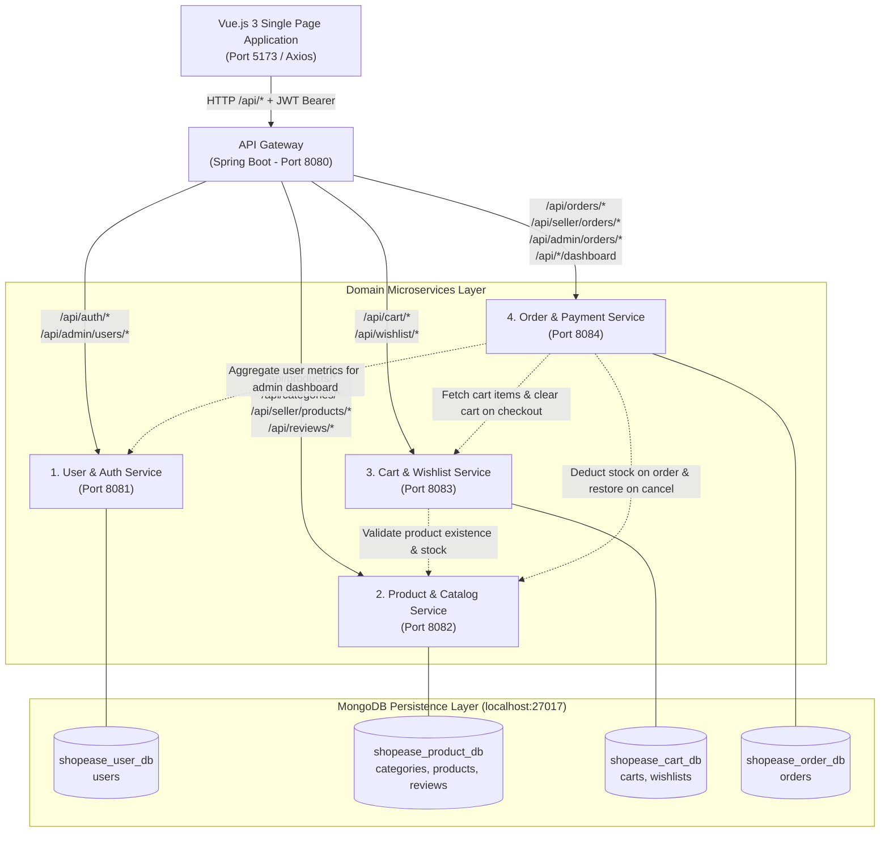

# ShopEase: Microservices Architecture Reference Manual

## Abstract

This document provides a comprehensive technical reference for the **ShopEase Microservices Architecture**. The system decomposes a monolithic e-commerce application into four independently deployable Spring Boot 3 domain services coordinated by an API Gateway. Persistence is isolated across dedicated MongoDB databases, and security is enforced using stateless JSON Web Tokens (JWT) with automated local key resolution and role-based access control.

---

## 1. System Architecture Diagram



---

## 2. Microservice Specifications & Port Matrix

| Service | Port | Database Name | Collections | Key Domain Responsibilities |
|---|---|---|---|---|
| **1. User & Auth Service**<br/>`user-service` | `8081` | `shopease_user_db` | `users` | Customer & Seller registration, Login, BCrypt password hashing, JWT signing, user profile retrieval, account status toggle, user listing for administrators. |
| **2. Product Service**<br/>`product-service` | `8082` | `shopease_product_db` | `categories`<br>`products`<br>`reviews` | Category CRUD, product catalog with keyword search, price range filtering, seller product management, customer review submission, rating aggregation, atomic inventory stock deduction and restoration. |
| **3. Cart & Wishlist Service**<br/>`cart-service` | `8083` | `shopease_cart_db` | `carts`<br>`wishlists` | Persistent shopping cart management (add, update quantity, remove, clear, item count), stock verification via Product Service, customer wishlist, and move-to-cart operations. |
| **4. Order & Payment Service**<br/>`order-service` | `8084` | `shopease_order_db` | `orders` | Checkout orchestration, mock payment processing (Card & Cash on Delivery), order cancellation with inventory restitution, seller-filtered order fulfillment, admin order monitoring, and dashboard analytics aggregation. |
| **5. API Gateway**<br/>`api-gateway` | `8080` | *Stateless* | *None* | Unified reverse proxy routing frontend requests to downstream microservices, CORS enforcement, and transparent JWT Authorization header forwarding. |

---

## 3. Inter-Service Communication Workflows

### 3.1 Cart Item Addition Workflow
1. Client issues `POST /api/cart/add` through the API Gateway with JWT Bearer token.
2. Gateway routes request to `cart-service` (Port 8083).
3. `cart-service` makes a synchronous REST call to `product-service` (`GET /api/products/{id}`) via `RestClient`.
4. `product-service` verifies product existence and confirms requested quantity does not exceed available stock.
5. If stock is sufficient, `cart-service` updates or inserts the cart item and persists the cart to `shopease_cart_db`.

### 3.2 Distributed Checkout Workflow
1. Client submits shipping and payment details via `POST /api/orders/customer/checkout`.
2. Gateway routes to `order-service` (Port 8084).
3. `order-service` contacts `cart-service` (`GET /api/cart/internal/user/{userId}`) to retrieve active cart items and compute the total.
4. `order-service` calls `product-service` (`POST /api/products/internal/deduct-stock`) to atomically decrement stock for all purchased items.
5. `order-service` persists the new order to `shopease_order_db` with status `PENDING` (or `COMPLETED` payment status for card mock payment).
6. `order-service` calls `cart-service` (`DELETE /api/cart/internal/clear/{userId}`) to empty the customer's cart.
7. Order confirmation is returned to the client.

### 3.3 Order Cancellation & Inventory Restitution
1. Customer initiates cancellation via `PUT /api/orders/customer/{orderId}/cancel`.
2. `order-service` validates that the order is in `PENDING` or `CONFIRMED` state and belongs to the calling user.
3. `order-service` calls `product-service` (`POST /api/products/internal/restore-stock`) to return the exact item quantities back to active inventory.
4. `order-service` updates order status to `CANCELLED` and marks payment status as `REFUNDED`.

---

## 4. Security Architecture & Zero-Secret Policy

### 4.1 Stateless JWT Authentication
- The system employs stateless JSON Web Tokens (HMAC-SHA256).
- When a user logs in, `user-service` issues a signed token embedding the `userId`, `username`, and `role` (`ADMIN`, `SELLER`, `CUSTOMER`).
- Downstream services (`product-service`, `cart-service`, `order-service`) validate the token signature independently using the shared cryptographic key without requiring direct database lookups against the `users` collection.

### 4.2 Automated Local Key Resolution (Zero Committed Secrets)
To eliminate secret leaks on public Git repositories:
- `application.yml` files declare `app.jwt.secret: ${JWT_SECRET:}` with **no hardcoded fallback string**.
- On startup, each microservice initializes `JwtService`:
  1. If the `JWT_SECRET` environment variable is defined, it is used immediately.
  2. If absent, the service accesses an uncommitted local key file in the user's home directory (`~/.shopease/.jwt_secret`).
  3. If the file does not exist, a cryptographically secure 256-bit key is generated once and saved locally.
- All four microservices read the same local file, guaranteeing consistent signature verification during local development without exposing keys to version control.

---

## 5. Development Environment Setup & Execution

### 5.1 Prerequisites
- **Java Development Kit (JDK)**: Version 17 or higher (JDK 21 / 24 fully supported).
- **MongoDB**: Version 6.0 or later running on `localhost:27017`.
- **Node.js**: Version 18+ and npm 9+ (for the Vue.js frontend).
- **IntelliJ IDEA**: Ultimate or Community Edition.

### 5.2 Opening in IntelliJ IDEA
1. Launch **IntelliJ IDEA**.
2. Select **File -> Open...** and choose the `microservices` directory:
   ```text
   /Users/jhansisiva/Documents/Win college /sem5/web devolopment/full_stack_shopping_cart/microservices
   ```
3. IntelliJ IDEA automatically detects the multi-module Maven structure (`pom.xml`) and configures all 5 modules:
   - `api-gateway`
   - `user-service`
   - `product-service`
   - `cart-service`
   - `order-service`
4. Pre-configured run configurations are stored in `microservices/.run/` and appear in the run menu.

### 5.3 Starting the Services
Start the services in the following order:
1. `UserServiceApplication` (Port 8081)
2. `ProductServiceApplication` (Port 8082)
3. `CartServiceApplication` (Port 8083)
4. `OrderServiceApplication` (Port 8084)
5. `ApiGatewayApplication` (Port 8080)

> **Tip for IntelliJ:** Open the **Services** tool window (**View -> Tool Windows -> Services** or `Cmd+8` on macOS) to run all 5 services with one click.

### 5.4 Starting the Frontend
In your terminal:
```bash
cd "/Users/jhansisiva/Documents/Win college /sem5/web devolopment/full_stack_shopping_cart/frontend"
npm run dev
```
Open your browser at `http://localhost:5173`. The Vue client communicates with the API Gateway at `http://localhost:8080/api` seamlessly.

---

## 6. Seeded Demo Accounts

On initial startup, default accounts are seeded into `shopease_user_db`:

| Role | Email | Password | Access Scope |
|---|---|---|---|
| **Administrator** | `admin@example.com` | `Admin@123` | Platform analytics, user activation/deletion, category management, order oversight. |
| **Seller** | `seller@example.com` | `Seller@123` | Seller dashboard, product creation, stock updates, fulfillment order management. |
| **Customer** | `customer@example.com` | `Customer@123` | Product catalog, cart, wishlist, checkout, review submissions, personal orders. |

---

## 7. Interactive API Documentation (Swagger / OpenAPI)

Each microservice exposes an interactive OpenAPI Swagger UI dashboard:

| Microservice | Swagger UI Endpoint | OpenAPI Specification |
|---|---|---|
| **User & Auth Service** | `http://localhost:8081/swagger-ui.html` | `http://localhost:8081/api-docs` |
| **Product Service** | `http://localhost:8082/swagger-ui.html` | `http://localhost:8082/api-docs` |
| **Cart Service** | `http://localhost:8083/swagger-ui.html` | `http://localhost:8083/api-docs` |
| **Order Service** | `http://localhost:8084/swagger-ui.html` | `http://localhost:8084/api-docs` |

---

## 8. Complete API Routing Reference

### API Gateway Routes (`http://localhost:8080/api`)

| Inbound Gateway Route | Destination Microservice | Method(s) | Description |
|---|---|---|---|
| `/api/auth/register` | `user-service:8081` | POST | Customer/Seller account creation |
| `/api/auth/login` | `user-service:8081` | POST | Authentication and JWT issuance |
| `/api/admin/users/**` | `user-service:8081` | GET, PUT, DELETE | Administrative user controls |
| `/api/customer/profile` | `user-service:8081` | GET | Authenticated customer profile |
| `/api/products/**` | `product-service:8082` | GET | Catalog browsing, search, and details |
| `/api/categories/**` | `product-service:8082` | GET | Category queries |
| `/api/admin/categories/**` | `product-service:8082` | POST, PUT, DELETE | Category creation, modification, removal |
| `/api/seller/products/**` | `product-service:8082` | GET, POST, PUT, DELETE | Seller product catalog management |
| `/api/reviews/**` | `product-service:8082` | GET, POST | Review retrieval and customer submission |
| `/api/cart/**` | `cart-service:8083` | GET, POST, PUT, DELETE | Shopping cart operations |
| `/api/wishlist/**` | `cart-service:8083` | GET, POST, DELETE | Wishlist operations and move-to-cart |
| `/api/orders/customer/**` | `order-service:8084` | GET, POST, PUT | Checkout, order history, cancellation |
| `/api/orders/seller/**` | `order-service:8084` | GET, PUT | Seller order status management |
| `/api/admin/orders` | `order-service:8084` | GET | Platform-wide order history |
| `/api/*/dashboard` | `order-service:8084` | GET | Customer, Seller, and Admin analytics |
